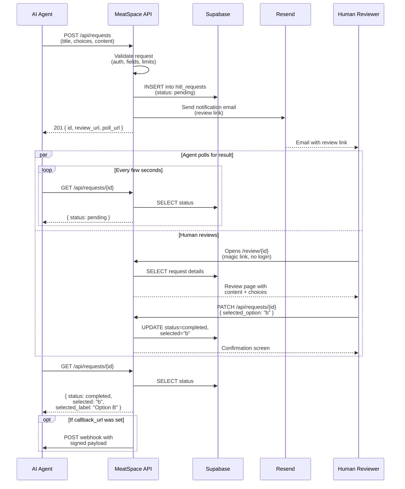
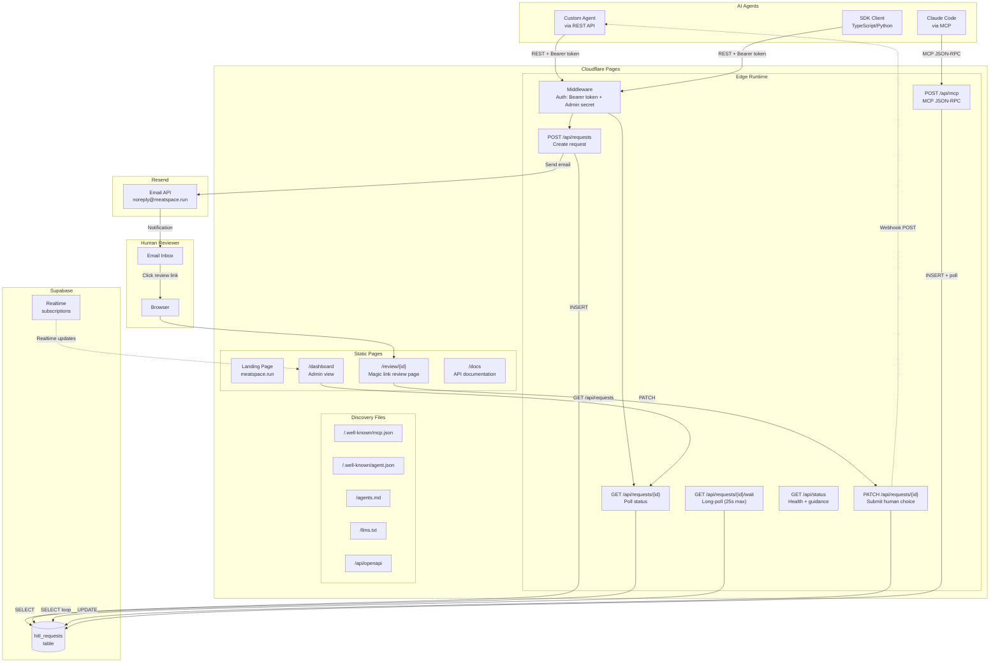
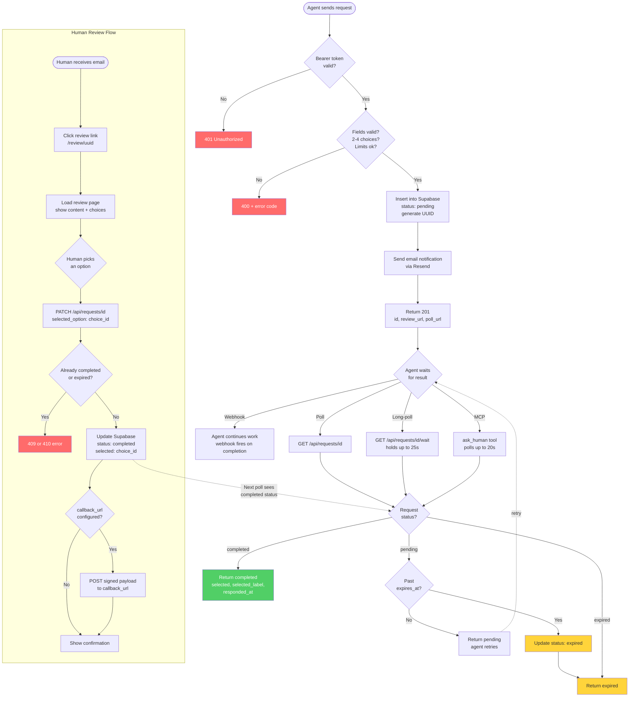

# MeatSpace Diagrams

## 1. User Flow

How a request moves from an AI agent to a human and back.

## 2. Architecture

How the components are deployed and connected.

## 3. Process Flow

The complete lifecycle of a single HITL request, including all possible states and error paths.

